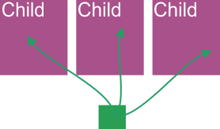
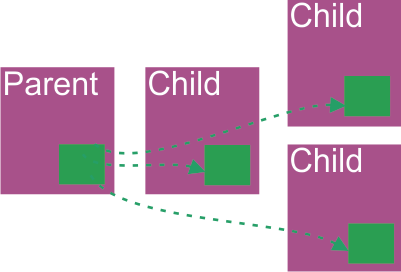

<!-- $theme: gaia -->

## Выступающий

* Yauheni Prakopchyk @asvae
* senior frontend developer
* opensource lead
* "старичок" vue.js (c 1.0)

-----

## Moя компания

* Epicmax
* 11е место в рейтинге гитхаба по vue.js
* Аутсорс, стартапы
* Нет менеджеров

-----

## Содержание

* Дробим приложение на репозитории.
* API веселые и скучные.
* Стор.
* Тестирование.
* Зависимости.
* Стили.
* Что это сейчас было?
  
-----

## Дробим приложение на репозитории

Если понадобилось:

* вынести часть логики из приложения, 
* использовать компоненты вне другого проекта,
* раздать права на редактирование различных частей приложения,

то пришла пора создавать новый репозиторий.

--------

### Бандлить или не бандлить

* Не стоит делать бандл, если без этого можно обойтись.

--------

### Основное приложение

* `package.json` - именно `dependencies`, не `peerDependencies` и не `devDependencies`.
```json


"dependencies": {
  "@company/child-library": 
  "git+https://github.com/company/child-library.git"
},


```

* любой модуль
```js
import { MyComponent } from '@company/library'
```

--------

### Библиотека

* `index.js`
```js
import MyComponent from './MyComponent.vue'
export {
  MyComponent,
}
```

* используете относительные пути

--------

### Как работать с разбитым проектом

* Держать в разных проектах, обновлять через `npm`.
* `npm link` - симлинк на дочерний проект из основного.

-----

### Что делать, если бандл все же нужен?

* Попытайтесь решить через `rollup`. Он умеет в tree-shaking.
* Если не выходит - через `webpack`.
* Дев сервер проще крутить на `webpack`, потому что HMR (hot module replacement).

-----


## Виды API

* веселые
* скучные

-----

### Веселые API

* Ошибки со статусом 200.
* `false` одним из вариантов: `0`, `‘0’`, `‘false'`.
* Приходят никому не нужные данные.
* Формат сохраняемых данных отличается от формата полученных.
* много других подобных штук...

-----

### Скучные API

* API без признаков `веселых`.

-----

### Что делать, если попался веселый API?

1. Поругаться с бекендерами.
2. Отгораживаться.

-----

### Отгораживаемся от api


* классы
* мапперы
* репозитории
* тесты API

-----

#### Классы > JS

+ декларация структуры данных
+ поддержка IDE

```js
export class Company {
  constructor (data) {
    this.id = undefined
    this.name = ''
    this.owner = null
    
    Object.assign(this, data) 
  }
}

new Company({ id: 5 })
```

-----

#### Классы > TypeScript

```typescript
class User {}

export class Company {
  id: number
  name: string = ''
  owner: User

  constructor (data: Partial<Company> = {}) {
    Object.assign(this, data)
  }
}
```

-----

#### Мапперы

* Суть - хелперы по преобразованию данных.
* Удобно тестировать через снепшоты.

```js
export class CompanyMapper {
  static toClass (data) {
    return new Company({ id: data.id, name: data.company_name })
  }
  static toObject (company) {
    return { id: company.id, company_name: company.name }
  }
}
```

-----

#### Репозиторий

Суть - обертка над ресурсом.

```js
export class CompanyRepository {
  static async create (company) {
    const payload = CompanyMapper.toObject(company)
    await axios.post('companies', payload)
  }
}
```

Пример:

```js
await CompanyRepository.create(company)
```
-----

#### Тесты API

* Суть - тесты репозитория. Бонус - блекбокс тестирование фронта.
* Фабрики, полезные также для фронтовых компонентов и дем.

Пример:
```js
const fresh = CompanyFactory.getNew()
const сreated = await CompanyRepository.create(fresh)
const loaded = await CompanyRepository.getOne(сreated)
expect(сreated.name).toBe(loaded.name)
```

-----

## Тесты
* Юнит тесты
* E2e (selenium, cypress)
* Демо (storybook, vue-book)

-----

### Юнит тесты

* Решения:
  * jest
  * mocha

(+) Легко тестировать изолированную логику (классы, функции)
(+) Дешевые
(+) Легко начать
(-) Сложно тестировать компоненты

-----

### e2e тесты

* Решения:
  * cypress
  * selenium

(+) Тестирование длинных сценариев
(-) Дорогие
(-) Сложно начать

-----

### Демо

[слайд с storybook и vue-book]

* Решения:
  * vue-storybook
  * vue-book

(+) Удобно тестировать компоненты
(+) Дешевые
(+) Легко начать
(-) Не автоматизированы

-----

## Хранилище (store) (vue)

1 - хранилище не нужно (props, emit)
2 - inject/provide
3 - refs
4 - es module
5 - vuex

-----

### Xранилище не нужно (props, emit)


(+) нативно
(+) просто
(-) не удобно для длинной вложенности (иногда)

* стандартный вариант

-----

### ES module



(+) нативно
(+) просто
(+) любая вложенность
(-) плохо масштабируется

* подходит для ранней разработки

-----

### inject / provide



(+) любая вложенность вниз
(-) не лаконично

* подходит для сервисов

-----

### vuex

**Осторожно ИМХО**

(-) не лаконично
(-) сложно
(-) нормализует объекты
(-) проблемы с модульностью

-----

## Стили

* Препроцессор (scss).
* Варианты:
  * scoped
  * bem

-----

#### Scoped

```html
<div class="active" data-v-f3f3eg9>
  <div class="header" data-v-f3f3eg9>
    <div class="title" data-v-f3f3eg9>
      Card Header Title
    </div>
    <div class="icon" data-v-f3f3eg9>😗</div>
  </div>
  Card Content
</div>
```

(+) лаконично
(-) шанс конфликта
(-) не видна структура из верстки

-----

#### BEM

```html
<div class="com-card com-card--active">
  <div class="com-card__header">
    <div class="com-card__header__title">
      Card Header Title
    </div>
    <div class="com-card__header__icon">😗</div>
  </div>
  Card Content
</div>
```

(+) мизерный шанс конфликта
(+) видна структура из верстки
(-) много буков

-----

## Зависимости

**Ощущения**
* Реализация: несколько часов
* Слишком просто, чтобы тестировать
* Дока не нужна - и так понятно

**Реальность**
* Реализация: дни/недели
* Тестов нужно в разы больше, чем на любой доменный компонент
* Не применим без документации

-----

### Что делать

* Украсть чужое

-----

### Как красть чужое

Сверху вниз растет цена решения.

* Взять готовую библиотеку
* Форкнуть + модифицировать готовую библиотеку
* Собрать свое из кусков чужого

-----

### Vue UI фреймворки
* Quasar
* Vuetify
* Vuestic

-----

### Quasar
* кроссплатформенный
* так себе функционал

-----

### Vuetify

* серьезный функционал
* модульность

-----

###  Последний слайд

Контактные данные
