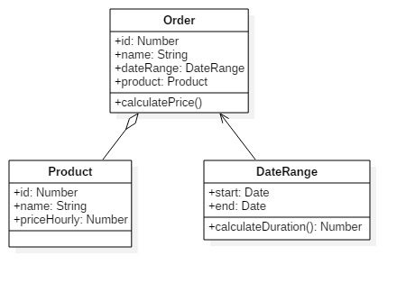

# Peculiar es6 mapping approach

**#javascript #es6 #vuejs 2017-05-21**


Today my talk covers response mapping. By mapping I mean converting standard js objects into classed es6 objects. The latter solution is much needed when working with deep nested structures as it allows to bind behaviour to data. 

## Premise

Let's say you're working on order editing form. Order contains product and rent date range.

Imagine you've sent a request like this:
```text
/api/orders/show
{
  "id": 10
}
```

And sure enough you got a response:

```json
{
  "id": 10,
  "name": "Room order",
  "product": {
    "id": 54,
    "name": "Room in fancy hotel",
    "hourly_price": "5.00"
  },
  "date_range": {
    "from": "2017-06-06",
    "to": "2017-06-08"
  }
}
```

You toss data in component and everything goes fine.

But at some point you decide to show order price in component. Which must be calculated depending on `product.hourly_price` and `order.date_range`. 

You might implement the calculation logic in component. But that won't scale. Because exactly the same calculation will be used in `CreateOrder` and `DisplayOrder` components. And maybe even `OrderList`. You never know.

## Mapping

Let's solve the problem OOP way.

Obviously we'd need 3 classes: `Order`, `Product` and `DateRange`. Implementing them one by one won't take long.



```javascript
class Order {
  id: Number
  name: String
  dateRange: DateRange
  product: Product

  constructor ({ id, name, dateRange, product } = {}) {
    this.id = id
    this.name = name || ''
    this.dateRange = new DateRange(dateRange) || null
    this.product = new Product(product) || null
  }

  /**
   * Calculate order price.
   * @returns {number}
   */
  calulatePrice (): Number {
    return this.dateRange.calculateDuration() * this.product.hourlyPrice
  }
}
```

```javascript
class Product {
  id: Number
  name: String
  hourlyPrice: Number

  constructor ({ id, name, hourlyPrice } = {}) {
    this.id = id
    this.name = name
    this.hourlyPrice = hourlyPrice
  }
}
```

```javascript
class DateRange {
  start: Date
  end: Date

  constructor ({ start, end } = {}) {
    this.start = Date(start)
    this.end = Date(end)
  }

  /**
   * DateRange duration in days.
   * @returns {number}
   */
  calculateDuration (): Number {
    // Copy date parts of the timestamps, discarding the time parts.
    const one = new Date(this.start.getYear(), this.start.getMonth(), this.start.getDate())
    const two = new Date(this.end.getYear(), this.end.getMonth(), this.end.getDate())

    // Do the math.
    const millisecondsPerDay = 1000 * 60 * 60 * 24
    const millisBetween = two.getTime() - one.getTime()
    const days = millisBetween / millisecondsPerDay

    // Round down.
    return Math.floor(days)
  }
}
```

After doing these classes actual mapping is a no-brainer:
```javascript
new Order(response)
```

As a result of mapping we get the same tree of data, but now it's (somewhat) typed and contains behaviour. Also note that children mapping happens free of charge. Meaning that after implementing a bunch of classes different tree configurations will be mapped automagically.

## In-component usage

Example component will be [`EditOrder.vue`][component code].

On `create` we will:
 
 * fetch via ajax the order data, 
 * promtly map it, 
 * then attach the mapped order to component, so that it could be displayed in template.

```javascript
    data () {
      return { editedOrder: null }
    },
    created (){
      // Here we're loading our order by ajax.
      const orderData = getOrderResponse()
      this.editedOrder = new Order(orderData)
    },
```

And here's the template itself.

```html
<div class="form" v-if="editedOrder">
    <input type="text" v-model="editedOrder.name">
    <div>{{editedOrder.calculatePrice()}}</div>
    <button @click="save"></button>
</div>
```

Price will be calculated, just as promised. While component and `Order` object are clean and testable. 

That's it. As always, I prepared full [source code][source code].

----------------

Feel free to leave stars [on github](https://github.com/asvae/my-articles) if you find my work useful : 3.
[Subscribing](/README.md) is also possible.

[component code]: https://github.com/asvae/my-articles/blob/master/es6-mapping/src/EditOrder.vue
[source code]: https://github.com/asvae/my-articles/tree/master/es6-mapping

