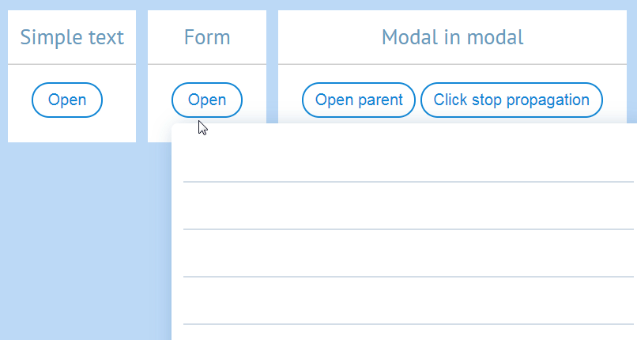
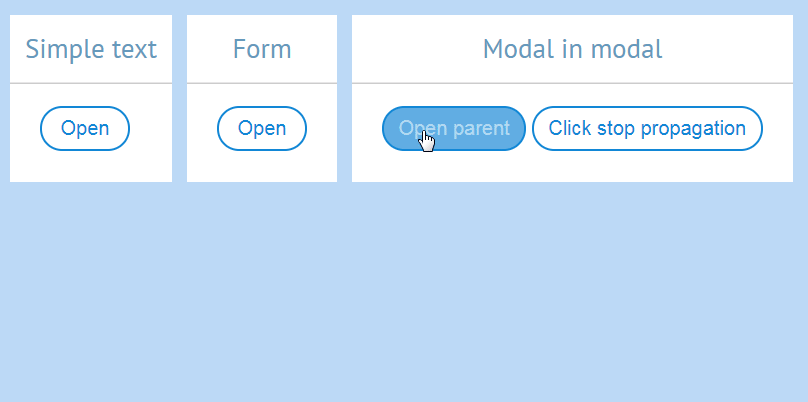

# Hunt for perfect modal

#modal #popup #javascript #vue 2017-05-08

Hi. Today we will pursue our dream for perfect modal. Being perfect means it:
* Appears over the page. Floats above everything else.
* Is not blocking.
* Supports nesting of any depth.
* Doesn't conflict with other elements on the page.
* Has mobile support.
 
 While point 5 doesn't belong the realm of mortals, points 1-4 are somewhat attainable.

## Full screen overlay



For this solution we create invisible overlay over whole window. Overlay catches all clicks.

### Template
```html
<div class="full-screen-overlay-modal">
    <div class="background"
         @click="hide()"
         v-if="isDisplayed"
    />
    <div class="content"
         v-if="isDisplayed"
    >
        <slot></slot>
    </div>
</div>
```

### Style
```scss
.full-screen-overlay-modal {
    &__background {
        position: fixed;
        z-index: 1000;
        left: 0;
        top: 0;
        width: 100%;
        height: 100%;
    }
    &__content {
        position: fixed;
        z-index: 2000;
        
        // Closing multiple modals won't work without this line. No idea as to why.
        transform: translateY(4px); 
    }
}
```

Looks fine, right? Except for it's blocking... Meaning to open another modal you have to close current. That's 2 actions instead of one. We can do better.

Check full code in **!!!TODO!!!**

## Stop propagation + window event


