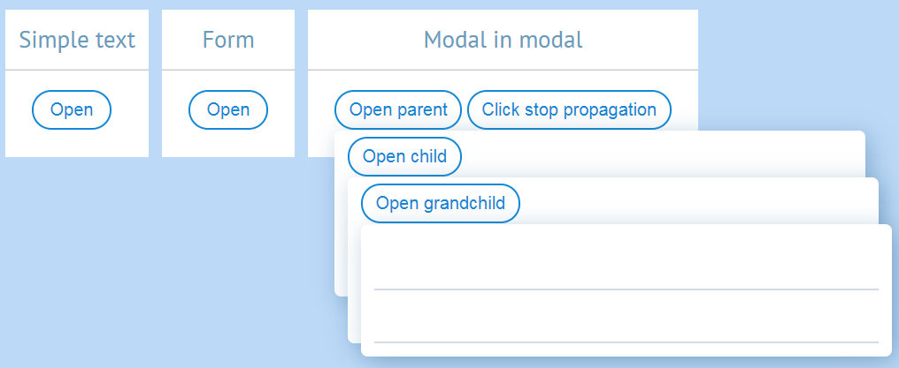

# Hunt for perfect modal

**#modal #popup #javascript #vuejs 2017-05-08**



Hey. Today we will pursue our dream for perfect modal. Being perfect means:
* Floats above everything else.
* Is not blocking.
* Supports nesting of any depth.
* Doesn't conflict with other elements on the page.
 
Seems easy enough, right? Let's glance over different solutions I harbored.

## Full screen overlay


For this solution we create invisible overlay over whole window. Overlay catches all clicks.

### Template
```html
<div class="full-screen-overlay-modal">
    <div class="background"
         @click="hide()"
         v-if="isDisplayed"
    />
    <div class="content"
         v-if="isDisplayed"
    >
        <slot></slot>
    </div>
</div>
```

### Style
```scss
.full-screen-overlay-modal {
    &__background {
        position: fixed;
        z-index: 1000;
        left: 0;
        top: 0;
        width: 100%;
        height: 100%;
    }
    &__content {
        position: fixed;
        z-index: 2000;
        
        // Closing multiple modals won't work without this line. No idea as to why.
        transform: translateY(4px); 
    }
}
```

Looks fine, right? Except for it's blocking... Which means that, in order to open another modal, user must close the current one. That's 2 actions and we can do better.

Here's the [component code][full screen overlay modal code].

## Stop propagation + document event


For this approach we attach click event handler to `document.body`, we also prevent click event propagation on modal click.
 
### Template
```html
<div class="document-event-modal">
    <div class="document-event-modal__content"
         @click.stop
         v-if="isDisplayed"
    >
        <slot></slot>
    </div>
</div>
```

### Script
```javascript
// ...
    methods: {
      show () {
        this.isDisplayed = true
        this.$emit('input', true)
        this.listen(true)
      },
      hide () {
        this.isDisplayed = false
        this.$emit('input', false)
        this.listen(false)
      },
      listen (on: Boolean = true) {
        // So that we won't add or remove same listener twice
        if (this.isListening === on) {
          return
        }

        // Adding or removing listeners.
        if (on) {
          setTimeout(() => {
            document.body.addEventListener('click', this.hide, false)
          })
        } else {
          document.body.removeEventListener('click', this.hide, false)
        }

        // Flag to know if listener is already registered.
        this.isListening = on
      }
    },
// ... 
```

The downside is that any other modal will prevent bubbling to `document`. 

Meaning no nesting `¯\_(ツ)_/¯`.


Here's the [component code][document event modal code].

## Document event + event target check


Ok. This is an ultimate solution. For the most part it's the same as previous one. Only that we won't prevent propagation. And instead we'll check the `event.target`.
 
### Template

Template is just normal. Nothing there.

```html
<div class="click-target-modal">
    <div class="click-target-modal__content"
         v-if="isDisplayed"
    >
        <slot></slot>
    </div>
</div>
```

### Script

We'll check, whether the component the click landed on is child of current modal. If not — modal hides itself.

```javascript
    import DomHelpers from './Utility/DomHelpers.js'

// ...
    methods: {
      click (event) {
        DomHelpers.isChild(this.$el, event.target) || this.hide()
      },  
    }  
// ... 
```
Here's the [component code][click target modal code].

Let's test it.

  - [x] Floats above everything else.
  - [x] Is not blocking.
  - [x] Supports nesting of any depth.
  - [x] Doesn't conflict with other elements on the page.
 
Done.

Check the [source code][source code] if you're looking for complete components.

----------------

[Tell me](/README.md) if anything is wrong or this modal is not nearly perfect in your opinion. : 3

[full screen overlay modal code]: https://github.com/asvae/my-articles/blob/master/perfect-modal/src/FullScreenOverlayModal.vue
[document event modal code]: https://github.com/asvae/my-articles/blob/master/perfect-modal/src/DocumentEventModal.vue
[click target modal code]: https://github.com/asvae/my-articles/blob/master/perfect-modal/src/ClickTargetModal.vue
[source code]: https://github.com/asvae/my-articles/tree/master/perfect-modal

