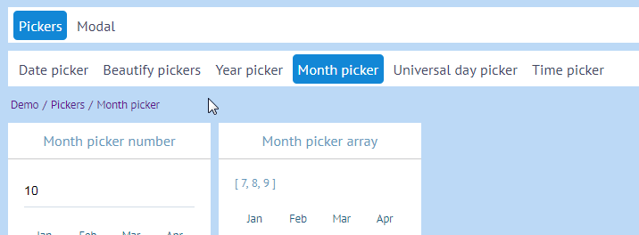

# Vue.js DYI smart navigation

**#navigation-panel #javascript #vue 2017-05-01**

*If you're vue developer this article will hit the spot. Beginner or not.*




Today I'll show how to make your own navigation component while attaining minimal duplication.

Here's the [code for code guys][navigation component].

## The problem

Take a look at the following code. That's how your navigation goes normally.

##### Template

```html
<router-link :to="{name: user}">User</router-link>
<div>
    <router-link :to="{name: settings}">Settings</router-link>
    <router-link :to="{name: company}">Company</router-link>
    <div>
        <!-- ... -->
    </div>
</div>
<!-- ... -->
```

##### Router 

```javascript
const routes = [{
  name: 'user',
  path: 'user',
  component: vmLayout,
  children: [
    {
      name: 'settings',
      path: 'settings',
      component: vmSettings,
    }, {
      name: 'company',
      path: 'company',
      component: vmCompany,
      children: [
         // ...
      ]
    },
    // ...
  ]
}]
```

You might notice that template part is clearly abundant in many cases. Optimal navigation component might look like this:
```html
<vm-navigation :routes="routes"/>
```

Let's try doing just that.

## Deliberation

We also want our navigation to be reactive and respond to route changes. For that I'd require full branch of `routes` nested object/array (sorry for my french). Assume we landed on `user/company` page. Given example above that would be an array like this:

```javascript
[
    routes,        //   DEPTH
    user,          //   ||
    userChildren,  //   ||
    company,       //   \/
]
```

Going into details of how it's done is out of scope of this article, so I got a helper [class on the ready][object helpers].

## Component

First let's declare the regular stuff:
```javascript
export default {
  name: 'Navigation',
  props: {
    routes: {
      type: Array,
      required: true,
    }
  },
}
```
Next let's prepare our routes to be used in template.
```javascript
import ObjectHelpers from './Utility/ObjectHelpers.js'

  // ...
  computed: {
    nestedParents () {
      return ObjectHelpers
          .traverseBranch(this.routes, { name: this.$route.name })
          .filter(route => !Array.isArray(route))
          .filter(route => route.children)
    },
  },
```

Our actions were:
* Find the route branch by route name.
* Filter out arrays. They're not needed.
* Filter out routes without children.

Now for template:
```html
<template>
    <div>
        <div class="navigation-block"
             v-for="parent in nestedParents"
        >
            <router-link class="navigation-block__item"
                         v-for="route in parent.children"
                         :key="route.name"
                         :to="{name: route.name}"
                         v-text="composeName(route)"
            />
        </div>
    </div>
</template>
```

We should also compose name for route to define how the name would be displayed. I use `route.meta.title` and then fall back to `route.name`. But you might as well derive your own scheme, using `vue-i18n`, for example. 

```javascript
  methods: {
    composeName (route){
      if (route.meta && route.meta.title) {
        return route.meta.title
      }

      return route.name
    },
  },
```

Toss in some styling and we're mostly done. 

## Breadcrumbs

Why not make breadcrumbs if all it takes is several lines of code?

```html
    <div class="breadcrumbs">
        <router-link class="breadcrumbs__item"
                     v-for="route in nestedRoutes"
                     :key="route.name"
                     :to="{name: route.name}"
                     v-text="composeName(route)"
        />
    </div>
```

```javascript
  computed: {
    nestedRoutes () {
      return ObjectHelpers
          .traverseBranch(this.routes, { name: this.$route.name })
          .filter(route => !Array.isArray(route))
    },
    nestedParents () {
      return this.nestedRoutes.filter(route => route.children)
    },
  },
```

If you missed something check the [complete component][navigation component]. You might also use it "as is" in case of harsh deadlines.

That's it. Let me know if it works for you.

[full source]: https://github.com/asvae/my-articles/blob/master/vue-navbar
[navigation component]: https://github.com/asvae/my-articles/blob/master/vue-navbar/src/NavigationBlock.vue
[object helpers]: https://github.com/asvae/my-articles/blob/master/vue-navbar/src/Utility/ObjectHelpers.js